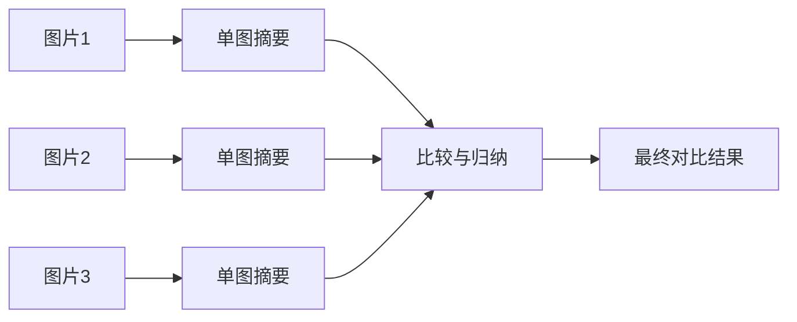

# Extra02 多图输入与比较专题

## 与正文如何对照读

多图 = **输入变长 + 关系变复杂**，正文里建议按下表穿插：

| 正文 | 对照点 |
| --- | --- |
| [第三章 多模态生成架构](../docs/chapter3/第三章%20多模态生成架构.md) | Connector + LLM 下多图如何进 `messages`、是否受上下文长度约束 |
| [第五章 评测](../docs/chapter5/第五章%20评测体系与工程选型.md) | 评测集按「单图 / 多图 / 比较类问题」分 `tags`，单独看失败率 |
| [第六章 部署](../docs/chapter6/第六章%20推理部署与%20Serving.md) | 多图上传顺序、总像素与超时；是否需要服务端组 batch |
| [第八章 Demo](../docs/chapter8/第八章%20构建一个图像问答%20Demo.md) | 在单图 Demo 上扩展多图上传与「图1/图2」编号提示 |
| [第九章 Agent](../docs/chapter9/第九章%20从单模态%20Agent%20到多模态%20Agent.md) | 多轮里缓存各图摘要，再交给规划模块做对比 |

若单图细节都糊，多图只会更糟：可先回顾 [第二章](../docs/chapter2/第二章%20视觉编码器与跨模态对齐.md) 的分辨率与 token。

## 一、为什么多图输入是多模态应用的高频需求

很多现实任务并不是“看一张图然后回答问题”，而是需要模型同时看多张图、比较多张图、从多张图中归纳变化。

典型场景包括：

- 商品多视角展示
- 施工前后对比
- UI 改版前后分析
- 质检中的合格 / 不合格对照
- 医疗或工业中的时间序列变化观察

如果系统只能稳定处理单图，它在很多业务里其实还不够用。

## 二、多图任务和单图任务的核心差别

单图任务的重点是“图像理解”；多图任务除了图像理解，还要解决：

- 图像顺序
- 跨图对应关系
- 比较维度
- 归纳方式
- 长上下文成本

你可以把它理解成：多图任务本质上是在做“跨图推理”。

## 三、常见多图任务类型

### 1. 前后对比

例如“这两个版本界面有什么变化”“装修前后差异在哪里”。

### 2. 多视角归纳

例如同一商品的正面、侧面、细节图，要求总结卖点或判断缺陷。

### 3. 批量筛查

例如一组质检图片中，找出异常样本。

### 4. 时间序列变化

例如多天拍摄的仪表盘、工程现场、植物生长、病灶变化。

## 四、多图输入时最容易踩的坑

### 1. 模型不知道图片顺序

如果你只是把多张图片一起扔进去，没有告诉模型“第一张是什么，第二张是什么”，回答很容易混乱。

### 2. 比较维度没说清

“比较这两张图”过于宽泛。你应该明确：

- 比较布局
- 比较颜色
- 比较对象数量
- 比较错误信息

### 3. 多图导致上下文过长

图越多，视觉 token 越多，成本和信息噪声也会一起上升。

### 4. 模型把多图混成一张图的整体印象

这会让它忽略局部差异，给出泛化描述，而不是精准比较。

## 五、多图 Prompt 的一个有效写法

建议采用“编号 + 比较维度 + 输出格式”的方式。

例如：

```text
我会提供两张图片：
图 1：旧版页面截图
图 2：新版页面截图

请完成以下任务：
1. 对比两张图在布局上的主要变化
2. 对比按钮和导航结构的差异
3. 用 3 条要点总结新版相对旧版的变化
4. 如果无法确认，请明确说明“不确定”
```

这种写法的优势是：

- 降低模型混图概率
- 让比较任务更聚焦
- 输出更容易复核

## 六、工程上更稳的多图工作流

很多多图任务不一定要一次性把所有图片全送进去。更稳的策略是分层处理：



也就是说，先对每张图做单图摘要，再做跨图比较。这种方式的优势是：

- 更节省上下文
- 更容易定位是哪个环节出错
- 更容易和 Agent 工作流结合

## 七、一个实战案例：UI 版本对比助手

假设你要做一个“前后版本 UI 对比助手”，建议按这个顺序实现：

1. 给每张图分配明确编号
2. 先生成每张图的界面摘要
3. 提取关键元素，例如导航、按钮、表格、弹窗
4. 再让模型输出差异总结

你还可以进一步要求输出为固定结构：

```json
{
  "layout_changes": [],
  "button_changes": [],
  "risk_points": [],
  "summary": ""
}
```

这样更适合后续接产品评审或测试流程。

## 八、一个实战案例：商品多图卖点总结

商品图场景特别适合多图输入，因为单张图往往只能看到部分特征。

你可以这样设计：

1. 图 1：正面图
2. 图 2：细节图
3. 图 3：使用场景图

再要求模型：

- 汇总共性卖点
- 识别材质、结构和适用场景
- 输出更接近运营文案的结果

这种任务里，多图比单图更能体现“互补信息”的价值。

## 九、什么时候不适合把所有图片一次性输入

如果出现下面这些情况，建议拆批或分阶段处理：

- 图片很多，超过 5 到 10 张
- 每张图都包含大量小字
- 任务更偏细节抽取，而不是整体总结
- 模型上下文预算有限

这时候更好的做法通常是：

1. 先单图分析
2. 再做摘要压缩
3. 最后再做多图比较

## 十、和主章节的衔接建议

这一专题和下面内容结合最好：

- 第五章：可以单独设计“多图比较测试集”
- 第六章：你会更理解为什么多图会放大推理成本
- 第八章：Demo 可以扩成多图对比工具
- 第九章：Agent 可以先做单图摘要，再做跨图规划

## 十一、章末练习

1. 设计一个“前后版本截图对比”的 Prompt。
2. 举例说明为什么多图任务比单图任务更容易出现混淆。
3. 为一个商品多图任务设计输出 JSON 结构。
4. 思考：如果图片数量从 2 张变成 12 张，你会怎样改工作流？

