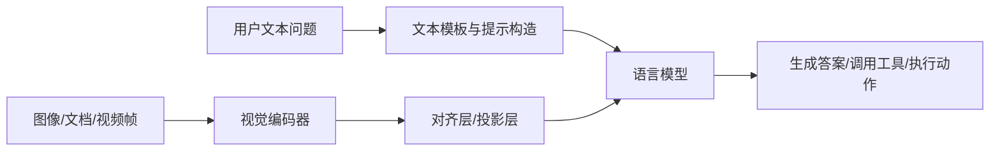

# 第一章 多模态大模型概览

> **理论篇**（第 1～4 章）：地图、视觉编码与对齐、生成架构、数据与微调。本章是理论篇入口。

承接 [前言](../前言.md) 里的章节依赖表：本章只搭**地图**——模块分工与任务版图；像素与 token 的细节在第二章，接到 LLM 做生成在第三章，动手脚本在第七、八章。

## 一、什么是多模态大模型

多模态大模型可以理解为“既能处理自然语言，又能处理其他感知信号”的生成式模型。最常见的是图文多模态，也就是模型同时接收图像和文本，并输出文本答案；但更广义地说，视频、音频、文档版面、表格、动作轨迹都可以视为模态。

与传统的单模态 LLM 相比，MLLM 多做了一件关键事情：**把来自不同感知通道的信息映射到一个能够共同推理的表示空间里**。

## 二、为什么多模态是大模型演进的自然下一步

真实世界的信息从来不是“纯文本”的。一个成熟的 AI 系统，如果只靠文字输入，就很难真正进入办公、客服、电商、教育、工业、医疗这些复杂场景。

多模态能力之所以重要，是因为它能够让模型：

- 看截图、看合同、看表格、看界面
- 结合视觉内容回答问题
- 基于图像证据生成更准确的文本
- 把感知、推理、行动串成完整工作流

从这个角度看，多模态并不是“LLM 的一个插件”，而是在把 LLM 从文字世界拉回真实世界。

## 三、一个多模态系统通常包含哪些模块



在这个最基础的链路里：

- `视觉编码器` 负责把像素信息变成向量表示
- `对齐层/投影层` 负责把视觉特征翻译成 LLM 能读懂的“语言”
- `语言模型` 负责生成回答、规划步骤、组织输出

这也是你后面阅读绝大多数视觉语言模型时最需要抓住的主线。

### 最小闭环（伪代码视角）

如果把上面的结构压缩成最小可执行思路，大致就是：

```python
# 1) 准备图像与问题
image = load_image("demo.jpg")
question = "截图里最关键的报错是什么？"

# 2) 图像编码 + 对齐
vision_tokens = vision_encoder(image)
aligned_tokens = connector(vision_tokens)

# 3) 与文本上下文一起送入 LLM
answer = llm.generate(text=question, visual_context=aligned_tokens)
print(answer)
```

这段伪代码的意义在于：先记住模块关系，再去看具体框架实现。

## 四、MLLM 和传统 CV、NLP、LLM 的区别

| 类型 | 典型输入 | 典型输出 | 核心目标 |
| --- | --- | --- | --- |
| 传统 CV 模型 | 图像 | 分类标签、框、分割结果 | 识别与定位 |
| 传统 NLP/LLM | 文本 | 文本 | 语言理解与生成 |
| 多模态大模型 | 图像 + 文本 / 文档 + 指令 | 文本、结构化结果、动作计划 | 感知 + 语言推理 |

这里最大的差别在于：传统 CV 模型通常输出固定结构，而多模态大模型更偏向“开放式生成”。这让它更灵活，也更容易出现幻觉、漏看细节、忽略空间关系等问题。

## 五、常见任务版图

### 1. 图像描述

输入一张图，输出一段文字描述。它是多模态入门任务，但不等于复杂视觉推理。

### 2. 视觉问答

输入图片和问题，例如“这张图里有几个人”“这份截图报的是什么错”。相比图像描述，VQA 更强调问题导向的证据提取。

### 3. OCR 与文档理解

输入票据、表格、合同、试卷、网页截图等复杂版面，输出文字或结构化字段。这类任务对细粒度视觉感知要求更高。

### 4. 图表与数学推理

模型不仅要读出元素，还要进行逻辑推理、比较、归纳和计算。

### 5. 多图、多轮、跨模态 Agent

系统要连续处理多张图、多轮历史、外部工具返回结果，并形成一个长期工作流。

## 新手最容易混的几个概念

| 任务 | 典型输入 | 核心关注点 | 常见误区 |
| --- | --- | --- | --- |
| 图像描述 | 图片 | 场景整体语义 | 误以为描述好就等于能做细节问答 |
| 视觉问答（VQA） | 图片 + 问题 | 问题导向证据提取 | 只会泛化描述，不正面回答问题 |
| OCR/文档理解 | 截图/票据/合同 | 小字、版面、字段关系 | 把 OCR 当普通描述任务处理 |
| 多模态 Agent | 多图 + 多轮 + 工具 | 任务分解与执行流程 | 只做一次回答，不做闭环 |

这些任务对视觉 token 粒度的要求是递增的，这一点会在第二章详细展开。读**理论篇**时把「粒度」记在脑子里；进入**实战篇**评测后，用**同一张图**分别问「描述类」和「读小字/OCR 类」问题，你会最直观地看到粒度不足时长什么样。

## 六、为什么“会看图”不等于“真的理解图”

多模态系统很容易给人一种错觉：只要接上图片输入，模型就具备了图像理解能力。实际上，它的上限取决于四件事：

1. 视觉编码器有没有保留足够的信息。
2. 对齐过程有没有把视觉语义成功映射到语言空间。
3. 训练数据里有没有覆盖你关心的场景。
4. 推理阶段有没有因为裁剪、分辨率、压缩或模板问题丢失关键信息。

这也是为什么有些模型能描述场景，却做不好 OCR；有些模型能理解自然图像，却在图表和长文档上表现一般。

## 七、主流能力边界

在工程里，你应该默认多模态模型有以下几个常见风险：

- 会遗漏小字、角落文字、密集表格单元格
- 会把“看起来合理”的答案当成“看到了的证据”
- 会忽视相对位置、方向和层级关系
- 会在中文截图、UI、长文档、多图链路上性能下降

把这些风险落到具体画面上会更直观，例如：

- **后台列表截图**：金额、状态在表格最右一列，模型只概括「有很多行数据」却读不出某一行的具体金额。
- **移动端弹窗**：「取消 / 确定」上下排列，模型描述成左右或搞反默认焦点。
- **图表截图**：问「第三根柱比第一根高多少」时，模型只给定性「略高」却算不出或算错比例。

所以，做业务时不能只看“能不能回答”，还要看：

- 答案是否真的基于图像证据
- 对错误是否可观测
- 是否有 fallback 机制

### 先看三个高频失败案例

如果你后面要做真实应用，这三类问题几乎一定会遇到：

1. **没看图就回答**：图像更换后答案几乎不变（典型表现是换一张完全不同的图，回答仍然是“图片里有一只猫”）。
2. **看图但看不细**：能概括主题，但看漏小字、按钮名、字段值。例如报错截图中把 “Error 404” 看成 “Error 40 4”，或忽略右下角的版本号小字。
3. **看到了但没推对**：读出了元素，却在比较、归纳、因果判断上出错。比如能认出多个按钮，但无法判断哪个是“确认”操作。

对应的修复方向也很明确：输入质量、视觉能力、推理链路，别混着改。这些案例在 [第二章](../chapter2/第二章%20视觉编码器与跨模态对齐.md) 的 Debug 清单和 [第五章](../chapter5/第五章%20评测体系与工程选型.md) 的评测脚本里都会反复出现。

## 八、学习 MLLM 最重要的三个问题

在后续章节中，你需要反复围绕这三个问题思考：

1. 图像是怎么进入 LLM 的？
2. 模型为什么能把视觉信息转成语言推理？
3. 什么决定了它在具体场景里的上限？

如果这三个问题打通了，多模态领域的大多数模型就不会再显得神秘。其中第 1、2 问主要在**理论篇**第二、三章落地；第 3 问需要**理论篇**第四章的数据配方，叠上**实战篇**第五章的评测场景，才能从「感觉不准」变成「哪一类样本在跌」。

## 九、实战衔接：先建立场景意识

读完这一章先别急着看论文，先做三个很轻的小练习，效果会更好。**动机**：先把「业务里到底有什么证据、会怎么失败」想清楚，再进第二章抠像素与 token，读起来不会飘。

### 练习 1：把你常见的工作流拆成模态

任选一个真实任务，例如“看报错截图定位问题”或“看商品图写卖点”，然后写下：

- 输入里有哪些模态
- 哪些信息是主要证据
- 哪些信息靠文本模型无法直接获得

这一步会帮助你真正理解“为什么要多模态”。

### 练习 2：找三个你见过的多模态产品

可以是截图助手、文档助手、拍照搜题、智能客服。分别判断它们更偏：

- 图像描述
- OCR / 文档理解
- 视觉问答
- 多模态 Agent

### 练习 3：给一个场景写出失败模式

例如“报错截图助手”的失败模式可以包括：

- 看漏错误码
- 把按钮名称看错
- 没有识别出系统环境信息
- 在没看清时强行回答

这一步能把“能力边界”变成工程上的风险意识。

## 十、本章概念如何直接影响后续代码

本章的「视觉编码器 → 对齐 → LLM」在仓库里不是抽象名词，而是下面几处**可直接在文件里搜到的锚点**（行号会随仓库演进变化，以你本地的 `def main` / 关键符号为准）：

- `docs/chapter7/code/transformers_chat.py`：在 `main()` 里搜 `messages = [`，看 `content` 里 `image` 与 `text` 如何并列；再搜 `apply_chat_template`（多轮格式与生成提示）、`process_vision_info` 与 `processor(`（像素如何进入视觉分支）——对应第一节伪代码里的 `vision_encoder` 与进入 LLM 之前的张量准备。
- `docs/chapter7/code/openai_compatible_client.py`：在 `main()` 里搜 `OpenAI(`、`to_data_url` 与 `chat.completions.create`，看 `messages` 里的 `image_url`（`data:` URL）；这是服务化时最常见的协议形态，字段缺失或顺序不符时往往在服务端报 400/422 一类错误（[第二章](../chapter2/第二章%20视觉编码器与跨模态对齐.md) Debug 清单会再对照）。
- `docs/chapter8/code/app.py`：搜 `chat.completions.create` 及其 `messages` 结构，是第七章脚本在 Gradio 里的「产品化」版本；习惯上应与 [第五章](../chapter5/第五章%20评测体系与工程选型.md) 中 `eval_vlm_dataset.py` 的发送方式一致，离线评测与线上 Demo 才能互相复现同一类失败。

带着「编码器 → 对齐 → 生成」读这几处，第一章的地图会直接落到可运行的请求体上；其中**分辨率与 patch 能保留多少视觉细节**，则是第二章要展开、并回扣到第五章「小字遗漏」评测的内容。

## 十一、章末练习

**动机**：这一章是全书地图；做完练习后你应能向同事用一张嘴说清「多模态系统几块拼起来、你的场景卡在哪一类任务」，后面各章只是在不同位置加深。

### 必做（5-10 分钟）

1. 用你自己的话解释“多模态不是多输入拼接，而是异构信息的联合推理”。
2. 任选一个场景，写出它的输入模态、输出形式、核心难点。

### 进阶（20-30 分钟）

1. 解释为什么一个能回答自然图像问题的模型，不一定能做好文档理解。
2. 对同一张图提出 3 个不同类型问题（描述/细节/OCR），记录模型回答差异。

### 挑战（1-2 小时）

1. 列出你最想做的 1 个多模态项目，并说明它更需要“感知”“推理”还是“工具调用”。
2. 为该项目写一个“失败模式清单”（至少 5 条）和对应 fallback 思路。

## 十二、可选配图

这一章如果要配图，优先放两张：系统链路图和任务版图。两张图就能把大部分概念讲清楚。

## 十三、本章小结

本章建立的是“地图意识”：

- 多模态不是简单叠加输入，而是异构信息的对齐与联合推理
- 一个 MLLM 至少包含视觉编码器、对齐模块和语言模型
- 真正的能力差异，通常出现在视觉表征、数据配方和推理链路上

下面从像素与 patch 进入第二章：视觉编码器与跨模态对齐。

## 十四、章节跳转

- 上一篇：[前言](../前言.md)
- 下一篇：[第二章 视觉编码器与跨模态对齐](../chapter2/第二章%20视觉编码器与跨模态对齐.md)
- 延伸实践（实战篇）：[第七章 动手跑通你的第一个 VLM](../chapter7/第七章%20动手跑通你的第一个%20VLM.md)
