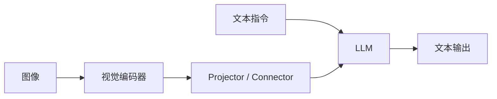

# 第三章 多模态生成架构

## 一、从“会匹配”到“会生成”

当你理解了视觉编码器和 CLIP 之后，下一步要解决的问题就是：模型怎样从“知道图文相似”进化到“能够围绕图像进行自然语言生成”。

生成式多模态模型的核心，不是把视觉模型和语言模型简单拼起来，而是找到一种代价可控、效果足够好、推理链路稳定的连接方式。

## 二、三条常见架构路线

### 路线 1：双塔检索式

这类模型以图像塔和文本塔为中心，主要做匹配和检索。它们适合：

- 以图搜文 / 以文搜图
- 跨模态分类
- 图文相似度排序

但不适合做复杂开放式生成。

### 路线 2：Connector + LLM

这是目前最常见的 VLM 方案。它的基本结构是：

这一路线最容易工程化，因为可以复用成熟的视觉编码器和成熟的 LLM，只在中间加一个连接模块。

### 路线 3：原生统一序列建模

这类模型试图把图像、音频、文本都转成统一 token，再交给同一套 Transformer 建模。理论上更统一，模态扩展性也更强，但训练成本、数据要求和系统复杂度通常更高。

## 三、Connector 到底在做什么

Connector 的作用可以简单理解为“翻译器”。

视觉编码器输出的特征空间和语言模型输入 embedding 空间通常不一样，直接硬拼接往往效果很差。Connector 负责把视觉特征变成语言模型可消费的输入。

它可能是：

- 一个线性层
- 一个 MLP
- 一个 Cross-Attention 模块
- 一组可学习 query

不同设计背后，对应的是不同的成本和表达能力取舍。

## 四、BLIP-2：轻量连接的经典范式

BLIP-2 的思路很有代表性：冻结强视觉模型，冻结强语言模型，只训练中间的小模块。

它的关键价值在于说明了一件事：**你不一定要把整个系统全部重新训练，才能让视觉能力接入 LLM。**

BLIP-2 式路线的优点：

- 训练成本相对低
- 容易复用已有模型能力
- 适合资源有限的团队快速验证

局限：

- Connector 容量有限时，复杂细节可能传不过去
- 如果只靠轻量模块，面对高难度 OCR、复杂推理场景时容易吃力

## 五、LLaVA：为什么视觉指令微调很重要

LLaVA 的工程启发非常强：它告诉大家，仅仅完成视觉对齐还不够，还需要“把模型调成一个真正会和用户对话的视觉助手”。

这带来了两个重要变化：

1. 数据形态从普通图文对，扩展到图像 + 指令 + 答案。
2. 训练目标从“语义接近”转向“面向任务的回答质量”。

这一步非常像 NLP 领域从预训练模型走向指令微调模型的过程。

## 六、现代 VLM 常见的两阶段训练

很多多模态生成模型都可以粗略看成两阶段：

### 阶段 1：预对齐

目标是先让视觉特征能够进入语言空间。常见做法是冻结大部分主体，只训练连接模块。

### 阶段 2：指令微调

目标是让模型学会按照用户意图回答问题、遵循格式、完成多轮对话。这个阶段会使用：

- 图文问答数据
- OCR 场景数据
- 图表和文档数据
- 推理数据
- 多轮对话数据

## 七、原生统一模型为什么更难

从长期看，统一架构当然很诱人。因为：

- 模态之间不必强行分成“视觉侧”和“语言侧”
- 多模态 token 可以共享更统一的建模范式
- 更容易往音频、视频等模态扩展

但它更难的地方也很明显：

- 训练数据更复杂
- 序列更长
- 预训练成本更高
- 工程细节更多，例如多模态 tokenizer、缓存管理、采样策略

所以对大多数个人学习者和中小团队来说，先理解 Connector 式路线，再研究统一架构，通常是更现实的顺序。

## 八、如何阅读一张多模态架构图

以后你再看到任何 VLM 架构图，建议按以下顺序拆：

1. 视觉输入经过什么编码器？
2. 有没有降采样、query、压缩、投影？
3. 图像特征以什么形式进入 LLM？
4. 训练时更新了哪些模块？
5. 输出是纯文本，还是还能产生结构化动作？

如果这五件事能答出来，基本就能把架构看明白。

## 九、不同路线的工程对比

| 路线 | 优点 | 局限 | 适合场景 |
| --- | --- | --- | --- |
| 双塔检索式 | 快、稳、适合匹配 | 不擅长开放生成 | 检索、召回、分类 |
| Connector + LLM | 工程成熟、扩展快 | 依赖对齐质量 | 图文对话、问答、文档理解 |
| 原生统一建模 | 理论上更统一 | 成本高、复杂度高 | 大规模研究或平台级系统 |

## 十、你真正需要掌握的不是“模型名”，而是“结构意识”

多模态模型名字很多，容易让人陷入“记模型谱系”的学习方式。但在工程实践里，更重要的是结构意识：

- 视觉侧强不强
- 对齐层怎么做
- 语言侧是否继续训练
- 数据是偏描述、OCR 还是推理

知道这些，你就能解释为什么两个模型在同一个场景里差距很大。

## 十一、实战衔接：如何拆一个开源 VLM 仓库

学完这一章后，建议你找一个开源视觉语言模型仓库，不要急着跑，先做“结构拆解”。

你可以按下面五个问题做笔记：

1. 用的是什么视觉编码器？
2. 图像特征通过什么模块进入 LLM？
3. 训练时冻结了哪些模块？
4. 数据更偏图像描述、OCR、对话，还是推理？
5. 推理接口是原生脚本，还是 OpenAI 兼容服务？

如果你能把这五个问题写清楚，你对架构的理解会比单纯阅读模型介绍深很多。

## 十二、章末练习

1. 为什么说 Connector 是现代多模态生成模型里的关键桥梁？
2. 比较双塔检索式和 Connector + LLM 两条路线的典型适用场景。
3. 解释为什么视觉指令微调对“助手感”很重要。
4. 找一个你感兴趣的模型，试着判断它更接近哪条架构路线。

## 十三、配图占位建议

- 建议图 1
  建议文件名：`docs/images/ch3-vlm-architectures.png`
  插入位置：第二节后
  画面描述：双塔检索式、Connector + LLM、原生统一建模三种路线的结构对比图。
- 建议图 2
  建议文件名：`docs/images/ch3-blip2-llava-compare.png`
  插入位置：第五节后
  画面描述：BLIP-2 和 LLaVA 在连接方式、训练目标、适用场景上的对比图。

## 十四、本章小结

- 现代多模态生成模型最常见的路线是“视觉编码器 + Connector + LLM”。
- 预对齐解决“接得上”，指令微调解决“答得好”。
- 学多模态时，不要只背模型名字，要学会拆系统结构。

下一章我们转向训练视角，理解数据、配方和微调为什么决定了模型的实战上限。

## 十五、章节跳转

- 上一篇：[第二章 视觉编码器与跨模态对齐](../chapter2/第二章%20视觉编码器与跨模态对齐.md)
- 下一篇：[第四章 数据、训练与微调](../chapter4/第四章%20数据、训练与微调.md)
- 对应实践：[第七章 动手跑通你的第一个 VLM](../chapter7/第七章%20动手跑通你的第一个%20VLM.md)
