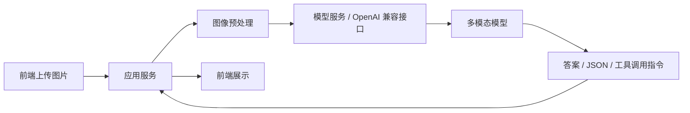

# 第六章 推理部署与 Serving

## 一、从“能跑”到“能服务”

学会调用多模态模型只是第一步。真正做应用时，你还需要考虑：

- 模型在哪里跑
- 图片怎么传入
- 接口如何暴露
- 延迟和吞吐能否接受
- 服务故障时如何回退

因此，这一章的重点是推理链路，而不是训练。

## 二、最常见的三种推理方式

### 1. 直接用 `Transformers` 本地推理

优点：

- 最直观
- 方便学习模型输入输出结构
- 适合做单机实验和最小 Demo

局限：

- 并发能力一般
- 服务化能力需要自己补
- 大模型场景下资源利用不一定最好

### 2. 用 OpenAI 兼容接口调用服务

优点：

- 上层应用接入简单
- 方便和现有聊天框架、Agent 框架整合
- 可以替换底层服务而不大改业务代码

局限：

- 需要服务端正确支持多模态 content schema
- 不同服务实现细节可能略有差异

### 3. 用专门的推理服务框架

例如面向高吞吐或生产环境的推理引擎、模型服务框架、网关层。这类方案适合：

- 模型较大
- 并发较高
- 需要统一管理多模型

## 三、一个典型服务链路长什么样

你应该特别注意中间两层：

- `图像预处理`
- `模型服务`

因为很多“模型不准”的问题，实际上是这两层造成的。

## 四、部署前需要先想清楚的资源问题

### 1. 显存

多模态模型除了语言部分，还要处理视觉特征，因此显存压力通常比同等级纯文本模型更高。

### 2. 分辨率

输入分辨率越高，视觉 token 越多，推理成本也越高。截图、文档、长图尤其明显。

### 3. 延迟

多模态请求通常包含图片读取、编码、预处理、序列构造，延迟不只是“模型生成时间”。

## 五、Prompt 和输入格式是部署稳定性的关键

很多部署问题不是模型本身的问题，而是：

- `messages` 格式不正确
- 图片 URL/base64 传法不正确
- chat template 没套对
- 文本和图像顺序不对

工程里一定要把“输入 schema”当成一等公民。

例如，视觉问答请求通常需要明确表达：

1. 这是图像输入
2. 这是文本问题
3. 生成时是否需要 JSON 或固定格式输出

## 六、如何做本地实验部署

对于教程项目，推荐先走下面这条最小路径：

1. 单机 `Transformers` 跑通。
2. 再改成 OpenAI 兼容客户端调用。
3. 最后再决定是否上更重的 Serving 方案。

这样做的好处是你能清晰分辨：

- 问题出在模型调用
- 还是问题出在服务封装

## 七、常见服务化设计

### 1. 统一入口

应用层统一调用 `/v1/chat/completions` 或类似接口，底层可以切换不同模型。

### 2. 模型路由

根据任务类型选择不同模型，例如：

- 截图/OCR 走文档能力更强的模型
- 自然图像问答走通用 VLM
- 高成本任务只在必要时启用大模型

### 3. 结果后处理

如果业务需要结构化字段，不要完全依赖自由文本，应增加：

- JSON 模板
- 字段校验
- 规则回退

## 八、多模态服务最常见的问题

### 1. 图片被错误压缩或缩放

原图里的小字在传输或预处理后已经糊了，模型当然读不出来。

### 2. 长图直接缩成小图

这会让模型完全丢失细节。更合理的方式是切块、分页或多图输入。

### 3. OpenAI 兼容接口和上层 SDK 不完全匹配

不同服务对图像消息字段的支持程度不同，最好先做一组最小请求验证。

### 4. 没有日志与采样

如果你不记录：

- 原始 prompt
- 图片路径或摘要
- 模型返回
- 错误日志

后续几乎无法定位问题。

## 九、上线前至少要做的观测

建议记录以下指标：

- 请求时间
- 图像加载时间
- 模型推理时间
- 输出 token 数
- 错误率
- 典型失败样例

这是后续优化延迟和稳定性的基础。

## 十、教程项目里的建议部署顺序

对个人仓库和学习项目来说，推荐顺序是：

1. 本地脚本
2. 简单 Web Demo
3. OpenAI 兼容封装
4. 路由和监控
5. 再考虑高并发优化

不要一开始就把自己拉进复杂的服务框架里。

## 十一、实战衔接：给你的 Demo 增加三层工程能力

在进入第七章和第八章前，建议你先给自己的思路加上下面三层“工程补丁”：

### 1. 输入校验

至少检查：

- 图片是否为空
- 文件类型是否合理
- 问题文本是否为空

### 2. 请求日志

至少记录：

- 请求时间
- 模型名
- 图片文件名
- 用户问题
- 响应耗时

### 3. 模型路由

即使一开始只接一个模型，也建议把调用逻辑写成独立函数，后续方便扩成：

- 自然图像模型
- OCR / 文档模型
- 高精度慢模型

你在第八章里做 Demo 时，这三个点会直接提升可维护性。

## 十二、章末练习

1. 比较“本地 `Transformers` 推理”和“OpenAI 兼容接口”两种方式的优缺点。
2. 如果你要处理长截图，为什么不能简单粗暴地缩小整张图？
3. 设计一个最小日志字段集合，用于排查多模态请求问题。
4. 为你准备做的 Demo 画一个简单服务链路图。

## 十三、配图占位建议

- 建议图 1
  建议文件名：`docs/images/ch6-serving-chain.png`
  插入位置：第三节后
  画面描述：前端、应用服务、预处理、模型服务、结果返回的部署链路图。
- 建议图 2
  建议文件名：`docs/images/ch6-long-image-risk.png`
  插入位置：第八节后
  画面描述：长图被直接缩小后小字模糊、信息丢失的前后对比图。

## 十四、本章小结

- 推理部署的关键，不只是“模型能跑”，而是“输入链路正确、延迟可接受、问题可定位”。
- 对教程项目来说，最稳的路线是先单机脚本，再服务封装，再做路由和优化。

下一章我们正式开始动手，跑通你的第一个视觉语言模型。

## 十五、章节跳转

- 上一篇：[第五章 评测体系与工程选型](../chapter5/第五章%20评测体系与工程选型.md)
- 下一篇：[第七章 动手跑通你的第一个 VLM](../chapter7/第七章%20动手跑通你的第一个%20VLM.md)
- 对应扩展：[Extra03 长图处理与切块策略专题](../../Extra-Chapter/Extra03-长图处理与切块策略专题.md)
